<div align="center">

# OPENHONK 🐸

### Rip Through the Veil of Lies

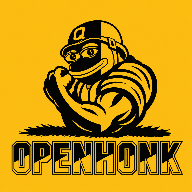

[](https://github.com/FrogIntel/OPENHONK/releases)
[](https://github.com/FrogIntel)

</div>

---

<p align="center">
📕 Unleash the Truth 📗 Fuck the Gatekeepers 🔥
</p>

Tired of Big Tech feeding you sanitized bullshit? **OPENHONK** is your Open Source Android weapon to shred the mainstream narrative and unearth the raw, unfiltered truth. Born from the ashes of Frog Intel, this app was banned by Google's thought police for daring to expose what they don't want you to know—COVID lies, election scams, and the deep-state's dirty secrets. Now, it's back, fiercer than ever, and it's **free**. No corporate overlords. No donations. Just pure, out-of-pocket rebellion.

<div align="center">

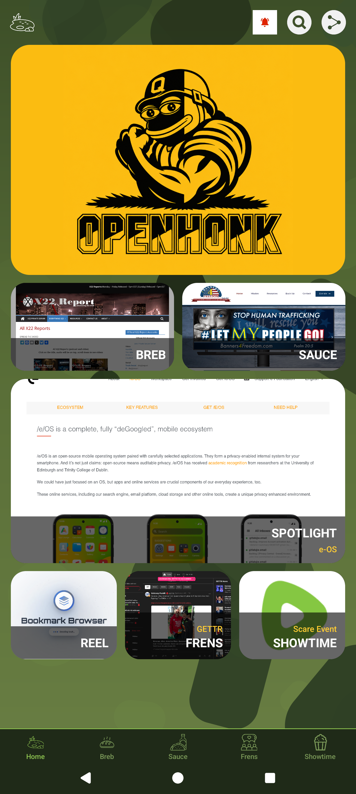

</div>

---

## 📥 Download Now!

[](https://github.com/FrogIntel/OPENHONK/releases)

> 🔶 Run through [VirusTotal](https://www.virustotal.com/) if unsure.

---

## ✨ Features

- **Tab Swiping**: Swipe between Home, Breb, Sauce, Frens, and Showtime tabs
- **Universal Search**: Search across all URLs, titles, and categories instantly
- **Built-in AdBlock**: Automatic ad blocking with EasyList — updates silently in the background
- **Background Playback**: Keep audio/video playing when you switch apps (Rumble, Bitchute, and more)
- **Privacy First**: Incognito WebView, no tracking, no analytics, no ads
- **HTTP Login Blocking**: Prevents password entry on insecure HTTP connections
- **Themes**: Choose between dark or light theme
- **Notifications**: In-app notification system with badge counts
- **Screenshot Caching**: Tiles load faster with cached screenshots and favicon fallbacks
- **Intro Walkthrough**: New users get a guided tour of key features
- **Share**: Spread the app with built-in sharing

---

## � Screenshots

<details>
<summary>Click to expand</summary>

<br>

<div align="center">

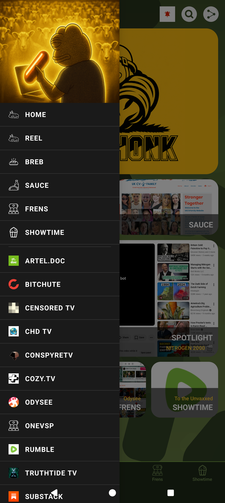

<details>
<summary>▶ Next</summary>

<br>

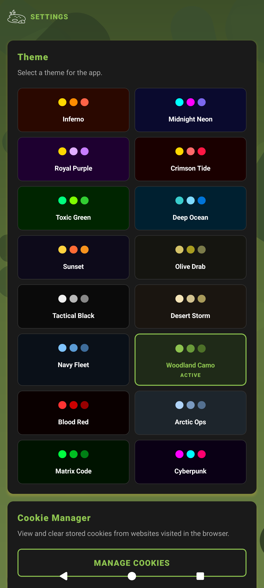

<details>
<summary>▶ Next</summary>

<br>

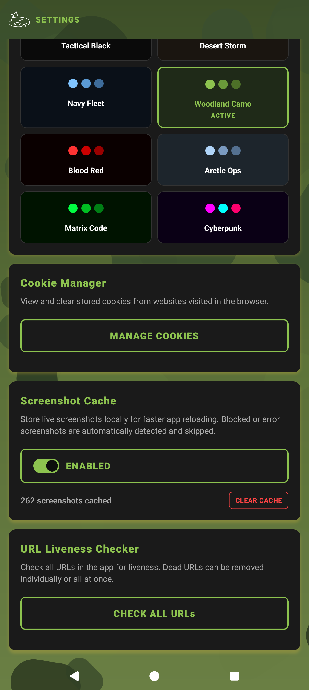

<details>
<summary>▶ Next</summary>

<br>

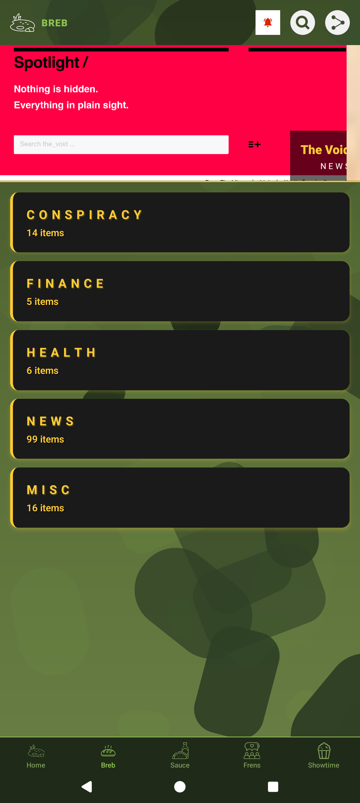

<details>
<summary>▶ Next</summary>

<br>


<details>
<summary>▶ Next</summary>

<br>

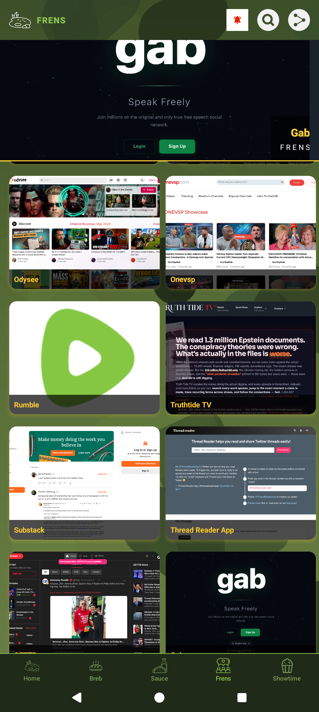

<details>
<summary>▶ Next</summary>

<br>

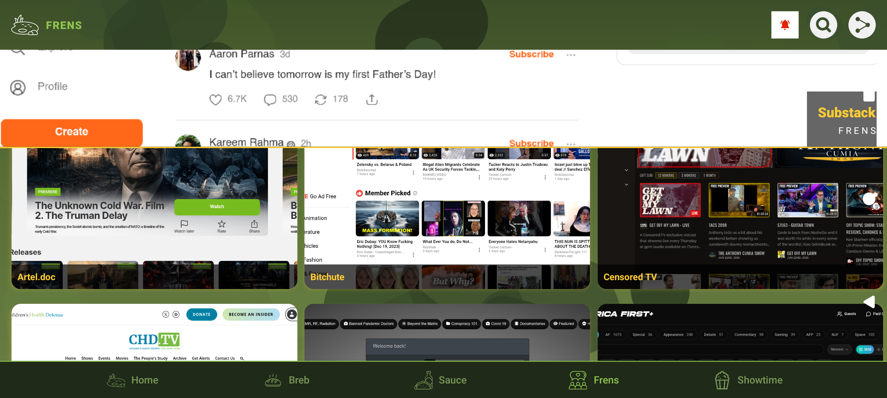

<details>
<summary>▶ Next</summary>

<br>

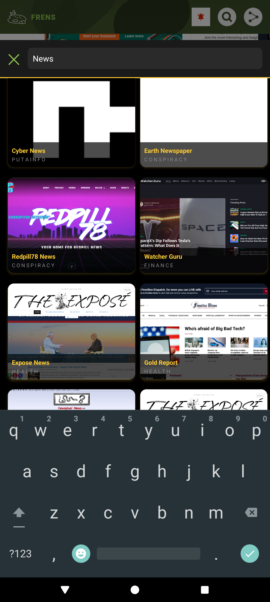

<details>
<summary>▶ Next</summary>

<br>

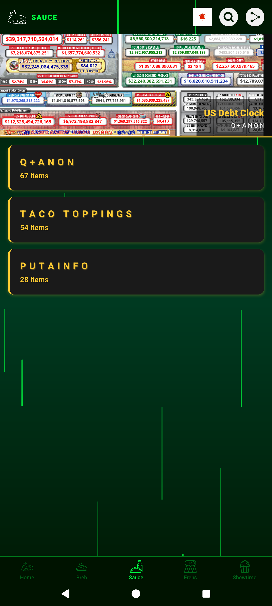

<details>
<summary>▶ Next</summary>

<br>

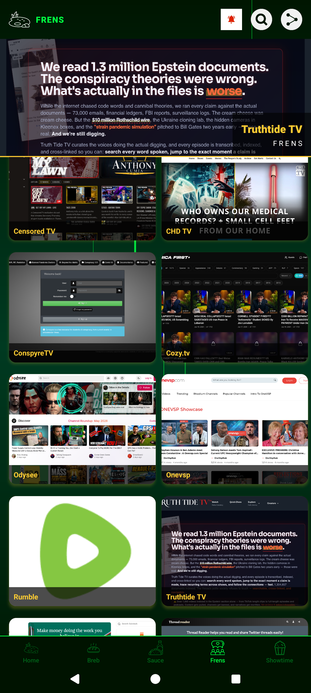

</details>
</details>
</details>
</details>
</details>
</details>
</details>
</details>
</details>
</details>

</div>

</details>

---

## �📱 Categories

| Tab | Content |
|-----|---------|
| 🏠 **Home** | Local OPENHONK homepage with WebView |
| 📰 **Breb** | News, conspiracy, alternative media, and OSINT tools |
| 📚 **Sauce** | Q-related research, Wikileaks, and truth sources |
| 👥 **Frens** | Social media platforms (X, Telegram, Truth Social, Gab, GETTR, Minds) |
| 🎬 **Showtime** | Video platforms (Rumble, Bitchute, Odysee) and documentaries |

---

## 🛠️ Building from Source

### Prerequisites

- Node.js v18+
- npm or yarn
- Android Studio with SDK (for Android builds)

### Setup

```bash
git clone https://github.com/FrogIntel/OPENHONK.git
cd OPENHONK
npm install
```

### Android Build

```bash
cd android
./gradlew.bat assembleRelease    # Windows
./gradlew assembleRelease          # macOS/Linux
```

The signed APK will be generated in the build output directory.

> **Note:** You'll need your own release keystore. Create one with:
> ```bash
> keytool -genkey -v -keystore android/app/release.keystore -alias openhonk-release -keyalg RSA -keysize 2048 -validity 10000
> ```
> Then configure the signing credentials in `android/app/build.gradle` under `signingConfigs.release`.

---

## 🔒 Privacy & Security

- **No tracking or analytics** — we don't want your data
- **No advertisements** — ever
- **Incognito WebView** — cookies cleared on exit
- **HTTP login blocking** — prevents credential entry on insecure sites
- **HTTPS indicator** — visual badge shows connection security
- **Recommended**: Use a zero-log VPN with DNS blocking

---

## 🗺️ Road Map

- ✅ Keep App Free
- ✅ Built-in AdBlock with auto-update
- ✅ Background audio/video playback
- ✅ Multi-step intro walkthrough
- ✅ Browser bookmark extension
- ⬜ Port to iOS
- TBC — see Telegram channel for more

---

## 📄 App Disclaimer

- Not all content in the app is correct
- We have left in some of this content to help calibrate discernment
- Please use discernment accordingly
- This app is free — we will never ask for donations
- Some content used in the app might not reflect the developers' views
- Do not use this app for your dopamine hits
- Recommended for 18+ use

---

## 🤝 Help Spread Awareness

OPENHONK funding is out of pocket. It's not people-funded, nor will it ask for donations. But we will ask: if you wish to share our business cards around, feel free to download and print them.

> Download the front of the card by downloading the banner at the top of the GitHub page.

---

## 📜 The Conscience of a Hacker

*by The Mentor — January 8, 1986*

> "I am a hacker, enter my world... Mine is a world that begins with school... I'm smarter than most of the other kids, this crap they teach us bores me..."
>
> "Yes, I am a criminal. My crime is that of curiosity. My crime is that of judging people by what they say and think, not what they look like. My crime is that of outsmarting you, something that you will never forgive me for."
>
> "I am a hacker, and this is my manifesto. You may stop this individual, but you can't stop us all... after all, we're all alike."

🔗 [Listen on YouTube](https://youtu.be/ecKP23EcXH4)

---

## 📜 A Cyberpunk Manifesto

*by Christian As. Kirtchev — February 14, 1997*

> "We are the ELECTRONIC MINDS, a group of free-minded rebels. Cyberpunks. We live in Cyberspace, we are everywhere, we know no boundaries."

🔗 [Listen on YouTube](https://youtu.be/e7QvPgEquUk)

---

## 🎵 The Conscious Vibe

Followed by the head dev for many years who witnessed the shadowbanning of this remarkable music channel. Embraced with 432hz & 528hz music mixes ranging from chillstep to drum and bass.

👉 [youtube.com/@NorthDawnstar](https://www.youtube.com/@NorthDawnstar)

---

## 🙏 Credits To

- Anons & Patriots
- Redpill Graphic Designers & Media Producers
- Sources pushing out truth and factual discernment
- Frens
- Confluxbot
- Luckypatcher
- Jotform
- Nicepage
- AppCreator24
- Devin AI

**Countries that assisted development:**
UK · USA · Norway · Mexico · Netherlands · Ireland · Hong Kong · Australia · France · Germany · India · Russia

---

## 📬 Contact & Support

- **GitHub**: [github.com/FrogIntel](https://github.com/FrogIntel)
- **Telegram**: [t.me/openhonk](https://t.me/openhonk)

---

<div align="center">

**The revolution won't be televised. It's on your phone. Grab it.** 🐸

</div>
